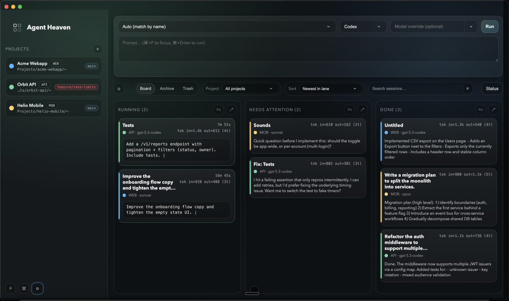

# Agent Heaven

<p align="center">
  <strong>Run, monitor, and control parallel agent jobs.</strong>
</p>

<p align="center">
  <a href="LICENSE"></a>
</p>

Agent Heaven is a local Electron desktop app that runs AI coding agents (OpenAI Codex CLI and/or Anthropic Claude Code CLI) as "cards" on a Kanban board and streams their output in real time.

## Key features

- Parallel AI coding agents as Kanban cards (Running / Needs Attention / Done)
- Live streaming output (terminal view + raw JSON logs)
- Built-in workflow actions (checkpoint changes, integrate to default branch, commit + push defaults)
- Smart job outcome handling (Done vs Needs Attention + merged label)
- Multi-project runs with persistent history (incl. Codex thread IDs / Claude session IDs for resume)
- Drag & drop attachments and file path autocomplete in prompts
- Follow-ups, auto-generated card titles, and open-in-Code from tasks
- Multi-window / multi-display support
- Themes, sounds, and global hotkey (optional)

<p align="center">
  
</p>

[Releases](https://github.com/grund3g/agent-heaven/releases/latest) · [Development](#development) · [License](LICENSE)

## Download / Install

- macOS: download the latest `.dmg` from GitHub Releases.
- Windows: download the latest `.exe` (installer) or `.zip` from GitHub Releases.
- Other platforms: build/run from source (Electron).

### Requirements

- `codex` (OpenAI Codex CLI) and/or `claude` (Claude Code CLI) installed and authenticated.
- For running from source or packaging: Node.js 22 + npm.

## Quick start

1. Add a project folder (the agent runs in that folder).
2. Start a job with a prompt (choose Codex or Claude).
3. Watch streaming output, send follow-ups, and drag in images/files as needed.

## Development

```bash
npm ci
npm run dev
```

`npm run dev` runs `tsc -w` and Electron together. Live reload is enabled by default for `renderer/*` and the preload script (compiled to `build/preload.js`).

## Tests

```bash
npm test
```

## Packaging

Build distributable artifacts:

```bash
npm ci
npm run dist
```

Build artifacts land in `dist/`.

### macOS notes

- Outputs: `.dmg` / `.zip`
- If you distribute unsigned builds, macOS Gatekeeper will likely block the first launch. Recipients can right-click the app -> Open (or allow it via System Settings -> Privacy & Security).
- For smooth distribution to others, you typically need code signing + notarization (Apple Developer ID).
- If the app can't find `codex` or `claude` (common when launching packaged apps from Finder), set Settings -> Codex path / Claude path to the full binary path. (Claude's local installer is typically `~/.claude/local/claude`.)

### Windows notes

- Outputs: `.exe` (NSIS installer) / `.zip`
- Unsigned builds will often trigger Windows SmartScreen warnings; code signing is recommended for distribution.
- If `node-pty` (native module) fails to build during install/packaging, install Visual Studio Build Tools (Desktop development with C++) and try again.
- If the app can't find `codex` or `claude`, set Settings -> Codex path / Claude path to the full binary path (Claude local installer is commonly `%USERPROFILE%\\.claude\\local\\claude.exe`).

## How it works (short)

Agent Heaven spawns a non-interactive agent process per card and parses the streamed JSONL:

- Codex: `codex exec --json` (and `codex exec resume --json`)
- Claude Code: `claude --print --output-format stream-json --verbose` (and `--resume <session-id>`)

Projects + settings are persisted; job history is persisted on disk (including IDs for resume).

## Contributing

Issues and pull requests are welcome.

- Please include a clear reproduction for bugs.
- Run tests locally with `npm test`.

## Safety / sandboxing

Agent Heaven runs `codex` / `claude` as normal child processes with your user permissions.

- Prefer using sandboxed modes and normal approval/permission flows.
- Avoid "dangerous" bypass flags unless you explicitly need them.

## License

MIT. See `LICENSE`.
